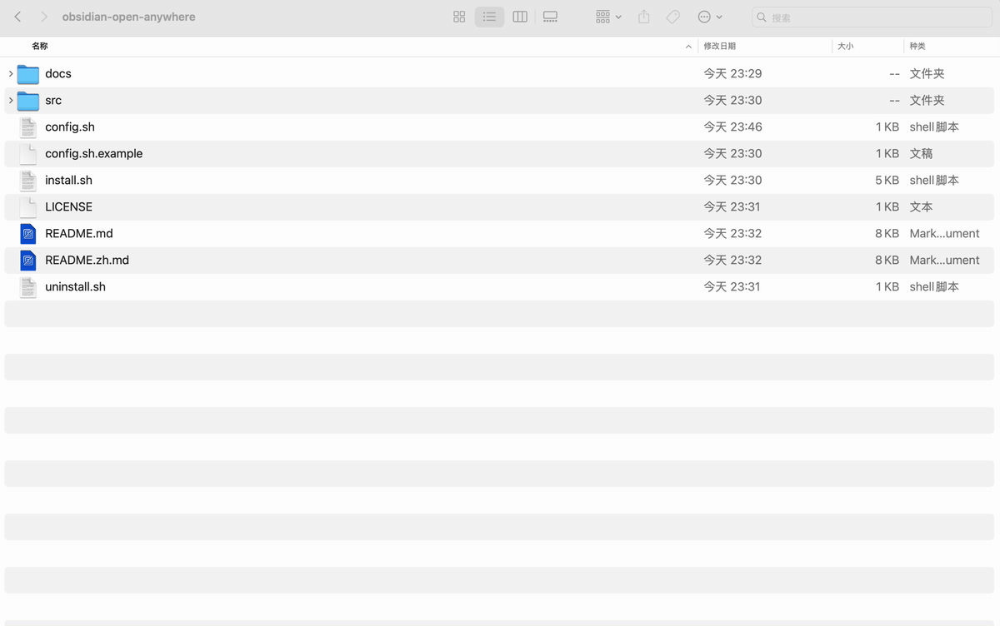

# Obsidian Open Anywhere

> **Open any external `.md` file in Obsidian by double-clicking it — even if the file lives outside your Vault.**
> macOS · zero dependencies · one shell script + one tiny `.app`.

[简体中文 README →](./README.zh.md)

---

## The problem

Obsidian only opens notes that live inside a Vault. If you double-click a markdown file anywhere else on your Mac — a download, an export from another tool, a `README.md` in a code repo — Obsidian either ignores it or refuses to open it properly. You lose backlinks, graph view, plugins, search, everything.

The official answer is "move it into your Vault first". That's exactly the friction this tool removes.

## What this does

`obsidian-open-anywhere` registers a tiny macOS app as a handler for `.md` files. When you double-click a markdown file anywhere on your Mac, it:

1. **Copies** the file into a configurable inbox folder inside your Obsidian Vault (default: `Inbox/`).
2. **Never overwrites** — filename collisions get a timestamp suffix, so the original is always safe.
3. **Opens** the copy in Obsidian using the `obsidian://open` URL scheme. Backlinks, graph, plugins all work.
4. **Leaves the original file untouched** wherever it was.

It works for double-click, drag-onto-app, and "Open With" in Finder. Multiple files at once are fine.

## Demo



```
~/Downloads/some-paper.md   ── double-click ──▶   Vault/Inbox/some-paper.md   ──▶   opens in Obsidian
```

If `Inbox/some-paper.md` already exists, the new copy becomes `some-paper-2026-06-04-1530.md`.

## Requirements

- macOS (tested on macOS 13+, should work back to 10.15)
- [Obsidian](https://obsidian.md/) installed, with at least one Vault
- Python 3 (preinstalled on modern macOS — used only for URL-encoding the filename)
- No Homebrew, no `node`, no `cask`, no background daemon

## Install

```bash
git clone https://github.com/Kt-L/obsidian-open-anywhere.git
cd obsidian-open-anywhere

# 1. Create your config
cp config.sh.example config.sh
# Edit config.sh and set VAULT_PATH to your Obsidian Vault.

# 2. Build and install
./install.sh
```

`install.sh` will:

- Compile the AppleScript into `ObsidianOpenAnywhere.app`
- Bundle the shell script + your config into the app
- Install to `/Applications/`
- Register the app as a `.md` handler with macOS LaunchServices

### Make it the default opener (one-time)

After install, tell Finder to use it for every `.md` file:

1. Right-click any `.md` file → **Get Info**
2. Under **Open with**, pick **Obsidian Open Anywhere**
3. Click **Change All…**

That's it. Double-click works from now on.

> First launch may show a Gatekeeper warning ("unidentified developer"). Go to **System Settings → Privacy & Security**, find the message at the bottom, and click **Open Anyway**. Required only once.

## Configuration

All settings live in `config.sh` (copied from `config.sh.example`):

| Variable | Default | What it does |
|---|---|---|
| `VAULT_PATH` | *(required)* | Absolute path to your Obsidian Vault root. `~` is expanded. |
| `VAULT_NAME` | basename of `VAULT_PATH` | The vault name used in `obsidian://` URLs. Override if you renamed your vault inside Obsidian. |
| `INBOX_SUBPATH` | `Inbox` | Subfolder inside the Vault where copies land. Auto-created. |
| `LOG_FILE` | `~/Library/Logs/obsidian-open-anywhere.log` | Where to log all actions. |
| `ALLOWED_EXTENSIONS` | `md markdown txt` | Space-separated list (lowercase, no dot). Other extensions are skipped. |
| `SHOW_NOTIFICATIONS` | `1` | Set to `0` to silence macOS notifications (errors still go to the log). |

After editing `config.sh`, re-run `./install.sh` to push the new config into the app bundle.

## How it works

The whole thing is two files:

- **`src/open-in-obsidian.sh`** — bash script that does the copy + URL-encoded `obsidian://open` call.
- **`src/ObsidianOpenAnywhere.applescript`** — a 20-line AppleScript droplet, compiled into a `.app` so macOS treats it as a real application that can receive files via the **Open** event.

The `.app` is registered with [`lsregister`](https://eclecticlight.co/2017/12/20/lsregister-launchservices/) so it shows up in Finder's "Open With" menu. Filename collisions inside the inbox folder get a `YYYY-MM-DD-HHMM` suffix; if even that collides, a numeric suffix is appended. The original file is never moved or modified.

## Uninstall

```bash
./uninstall.sh
```

Removes the `.app` and unregisters it. Your config, log file, and any files already copied into the Vault are left alone. If `.md` files still default to this app afterward, repeat the "Change All…" step pointing at Obsidian (or whatever you want instead).

## FAQ

**Q: Why not just set Obsidian itself as the default `.md` app?**
A: Try it. Double-clicking an external `.md` either does nothing useful, opens a broken view without backlinks, or shows an error — Obsidian can only render notes that live inside a Vault.

**Q: Does this duplicate every markdown file I ever open?**
A: Yes, by design — that's how the file ends up inside your Vault and gets indexed. The duplicates land in one folder (`Inbox/` by default) so you can review and decide where they belong (or just bulk-delete). Original files outside the Vault are never touched.

**Q: Can it move the original instead of copying?**
A: Not by default (too easy to lose work). If you want move-instead-of-copy, change `cp -p` to `mv` in `src/open-in-obsidian.sh` and re-run `./install.sh`.

**Q: What about Linux / Windows?**
A: This implementation is macOS-only (uses AppleScript + LaunchServices). The shell script alone is portable — you could wrap it differently on Linux (`.desktop` file with `MimeType=text/markdown`) or Windows (registry / `.bat`). PRs welcome.

**Q: Does this work with multi-vault setups?**
A: It points at one vault at a time (the one in `config.sh`). For multiple vaults you'd need separate `.app` instances with different bundle identifiers — not built-in, but easy to fork.

**Q: Does it sync? Does it conflict with iCloud / Dropbox / Syncthing on the Vault folder?**
A: It's a plain `cp` into the Vault folder. Whatever syncs the Vault will sync the new file normally.

**Q: Is the original file's mtime preserved?**
A: Yes (`cp -p`).

## Troubleshooting

- **Nothing happens on double-click** — check `~/Library/Logs/obsidian-open-anywhere.log`. The most common cause is `VAULT_PATH` pointing to a path that doesn't exist.
- **Wrong vault opens** — set `VAULT_NAME` explicitly in `config.sh` to match the name Obsidian shows in its vault switcher.
- **Gatekeeper blocks the app** — System Settings → Privacy & Security → "Open Anyway". Once-only.
- **"Open With" menu doesn't show the app** — run `./install.sh` again; it forces an `lsregister -f` refresh.

## Contributing

Issues and PRs welcome. Tiny and focused improvements preferred: cleaner Info.plist handling, Linux/Windows ports, a real app icon, optional move-instead-of-copy as a config flag, etc.

## License

MIT — see [LICENSE](./LICENSE).
